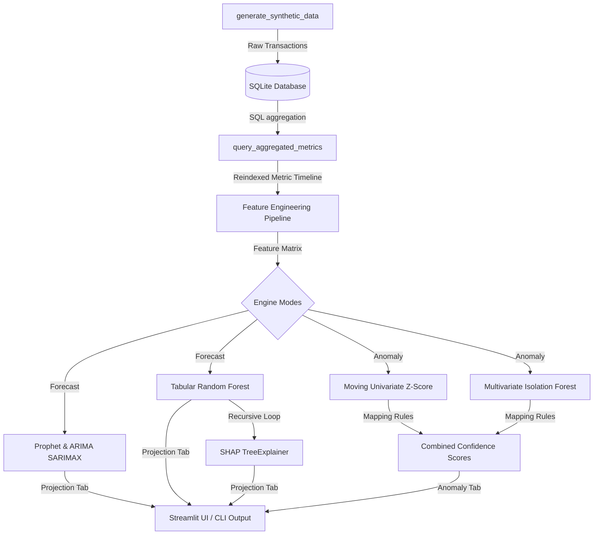

# 📊 Financial KPI Intelligence Dashboard

An enterprise-grade, TDD-built time-series forecasting and multivariate anomaly detection intelligence platform. It features classical and machine learning forecasting, interactive SHAP-based explainability waterfall charts, and combined confidence scoring for multivariate anomaly events.

---

## 🚀 Key Features

*   **Continuous Data Ingestion**: Dynamic SQL-based time-series aggregation (daily, weekly, monthly) over a multi-BU (E-commerce, SaaS, Enterprise Services) transaction database.
*   **Classical Time-Series Models**: Parallel fit for Facebook Prophet and ARIMA (statsmodels SARIMAX) with 95% confidence intervals and automated MAE/RMSE model comparison on a 90-day validation quarter.
*   **Tabular Machine Learning Projector**: Autoregressive Random Forest Regressor using engineered features (lags, rolling averages, calendar cycles) with recursive future forecast generation to prevent look-ahead bias.
*   **Explainable AI (SHAP Waterfall Charts)**: Detailed local SHAP waterfall attribution decomposition for future machine learning forecasts.
*   **Multivariate Anomaly Detection**:
    *   **Univariate flags**: Rolling 30-day moving Z-score checks on individual KPIs.
    *   **Multivariate flags**: Scikit-learn `IsolationForest` fitted on the daily 3D space (`Revenue`, `Cost`, `Volume`).
    *   **Combined Confidence Scores**: Assigns High (both flagged), Medium (Isolation Forest only), or Low (Z-score only) risk levels.
*   **Streamlit Interactive Visualization Dashboard**: Accented dark-themed, glassmorphic layout highlighting key KPIs, forecast projections, anomaly control rooms, and waterfall explanations.
*   **Developer CLI**: Structured diagnostics pipeline supporting data generation, model comparisons, and strict/standard/lenient anomaly summaries.

---

## 🛠️ Technology Stack

*   **Core**: Python 3.14.5, SQLite3, Pandas, NumPy
*   **Forecasting**: Facebook Prophet, Statsmodels (SARIMAX), Scikit-Learn
*   **Explainability**: SHAP (TreeExplainer)
*   **Visualization**: Streamlit, Plotly, Plotly Graph Objects
*   **Testing**: Pytest

---

## 📐 Architecture Overview



---

## 🔧 Installation & Setup

1.  **Clone the Repository**:
    ```bash
    git clone https://github.com/Stokesy-dev/Financial-kpi.git
    cd Financial-kpi
    ```

2.  **Activate Virtual Environment**:
    ```bash
    python3 -m venv venv
    source venv/bin/activate
    ```

3.  **Install Dependencies**:
    ```bash
    pip install -r requirements.txt
    ```

---

## 📖 CLI Usage Guidelines

The Developer CLI (`main.py`) provides commands for core backend tasks.

### 1. Database Generation & Diagnostics
Generate a fresh 3-year transactional database with injected domain-specific anomalies:
```bash
python main.py --mode generate
```

### 2. Time-Series Forecasting Projections
Fit Prophet, ARIMA, and Random Forest models on a selected BU and metric. Evaluates accuracy over the held-out quarter and projects 90 days into the future:
```bash
python main.py --mode forecast --bu saas --metric revenue
```

### 3. Anomaly Detection Pipeline
Run moving Z-scores and Isolation Forest across all metrics, printing a formatted ASCII summary table of flagged events matching a threshold:
```bash
python main.py --mode anomaly --threshold standard
```
*   `--threshold` choices: `strict` (Z > 3.5, 1% contamination), `standard` (Z > 3.0, 3% contamination), `lenient` (Z > 2.0, 5% contamination).

---

## 🖥️ Streamlit Interactive UI

Launch the premium intelligence dashboard:
```bash
streamlit run app.py
```
### Dashboard Tabs:
1.  **📂 Raw Data Explorer**: Complete tables and period-level aggregation statistics.
2.  **📈 Forecast Projection**: Forecast model line charts (Prophet vs. ARIMA vs. Random Forest) with validation metrics comparisons.
3.  **⚠️ Anomaly Dashboard**: Control room plotting historical metrics with interactive threshold selections and color-coded flags (🔴 High, 🟠 Medium, 🟡 Low confidence).
4.  **🧠 Explainability (SHAP)**: Select any date in the future forecast horizon to view Plotly-based SHAP Waterfall drivers.

---

## 🧪 Test Verification

Run the test suite (11 passing tests checking ingestion, database logic, feature engineering lag bounds, validation timelines, SHAP matrices, and Z-score/Isolation Forest mappings):
```bash
PYTHONPATH=. pytest
```
